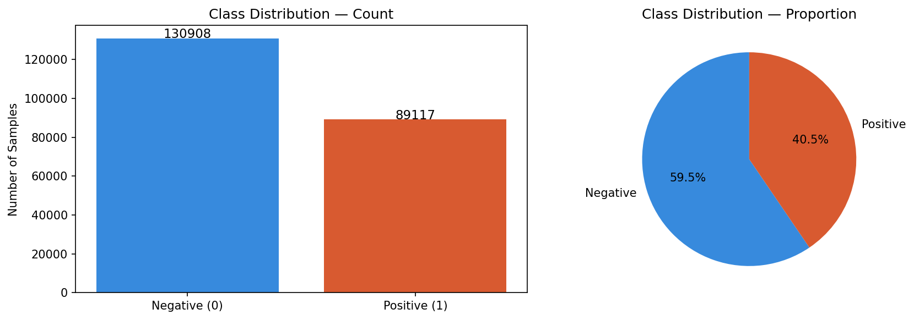
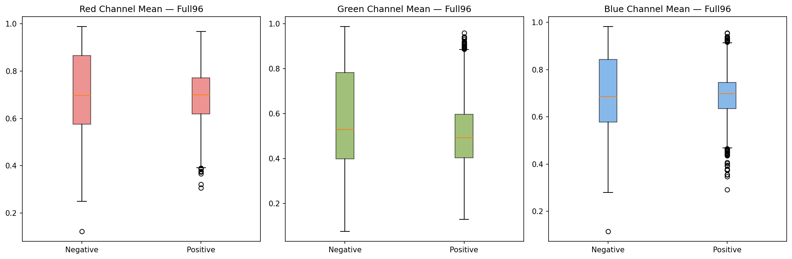
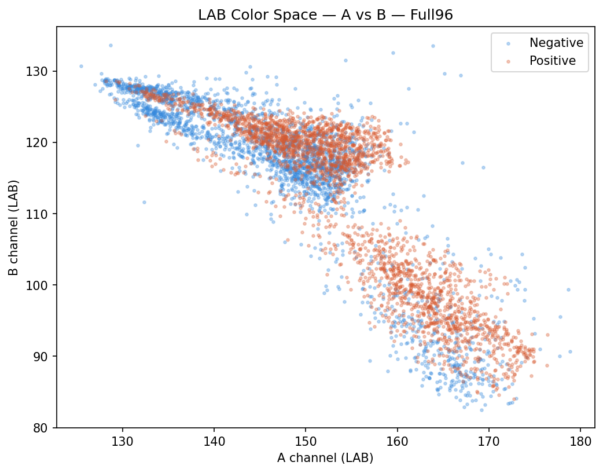
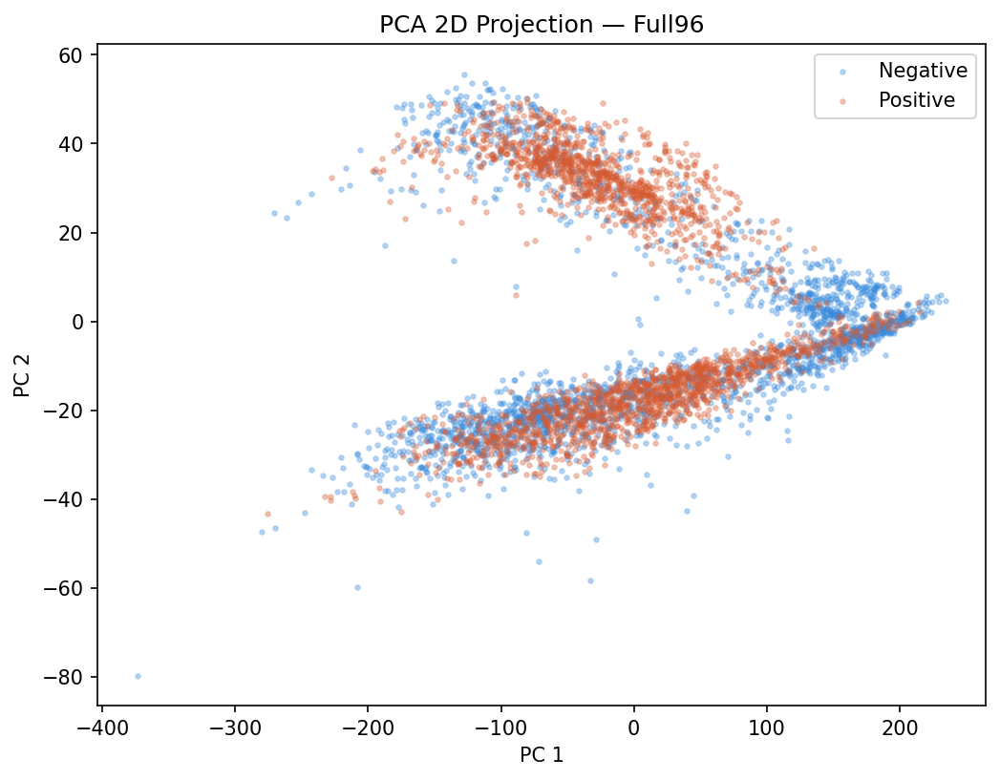
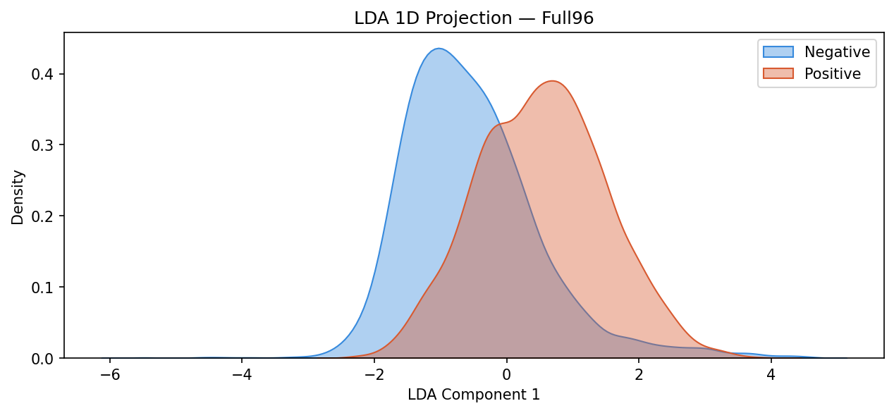
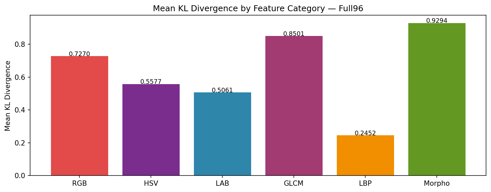
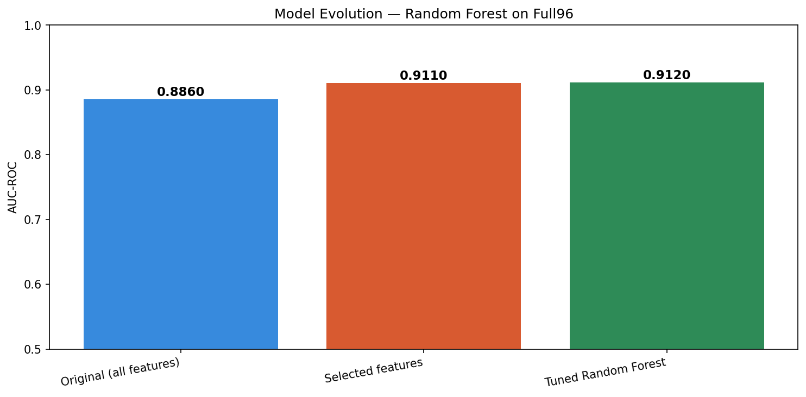

# Histopathologic Cancer Detection: Comprehensive Master Report (Phases 1-16)

The following is summary of the Kaggle Histopathologic Cancer Detection project, covering Exploratory Data Analysis (EDA), Feature Engineering, Feature Selection, and Model Tuning over 16 distinct phases.

---

## 1. Project Background and Assumptions

### Objective
The goal is to classify 96x96px RGB images of lymph node tissue patches as either containing metastatic tumor tissue (Positive) or not (Negative). 

### Core Assumptions
- **Diagnostic Region:** A positive label indicates that at least one pixel of tumor tissue is present in the **center 32x32px region** of the image. Tumor tissue in the outer periphery does not count.
- **Track Paradigm:** Because of this labeling rule, we assumed it was strictly necessary to evaluate the center 32x32 crop independently against the full 96x96 image. Therefore, the entire pipeline was duplicated across two tracks: **Full96** and **Crop32**.
- **Classical ML Baseline:** We assumed that before jumping to deep learning (CNNs), it is scientifically rigorous to establish a baseline using classical machine learning on extracted statistical, texture, and morphological features.

---

## 2. Dataset Normalization and Preprocessing (Phase 1-2)

### Sampling
The dataset contains ~220k images. Due to memory constraints for in-memory PCA/LDA and classical ML, we took a **stratified random sample of 5,000 images** (perfectly balanced 2,500 positive, 2,500 negative) with a fixed random seed (`42`) for reproducibility.

### Normalization
- **Pixel Intensity Normalization:** All raw 8-bit image pixels `[0, 255]` were Min-Max scaled to `[0.0, 1.0]` immediately upon loading (by dividing by 255.0).
- **Standard Scaling:** Before applying PCA, LDA, and all Classification models (Logistic Regression, SVM, KNN, RF, GBM), the extracted feature matrices were standardized using `sklearn.preprocessing.StandardScaler` (zero mean, unit variance). This is critical for distance-based models (KNN) and gradient descent algorithms (LogReg, SVM).

### Class Distribution
Original Imbalance: ~1.46 Negative to 1 Positive.

---

## 3. Extracted Features (Phases 3-6)

We extracted 40 features across 4 broad categories.

1. **Color Statistics (12 features):** Mean and Standard Deviation across RGB. Mean across HSV and LAB color spaces. 
   - *Finding:* Positive patches inherently display higher red-channel intensity and lower lightness.
2. **Texture / GLCM (5 features):** Gray-Level Co-occurrence Matrix features (Contrast, Dissimilarity, Homogeneity, Energy, Correlation).
   - *Finding:* Tumor regions are significantly less homogenous and have higher contrast.
3. **Texture / LBP (26 features):** Local Binary Pattern histogram bins + entropy. Captures micro-patterns (edges, curves, flat spots) independently of illumination.
4. **Morphological (2 features):** Laplacian Variance (Sharpness) and Canny Edge Density.

### Heatmap/Distributions

---

## 4. Dimensionality Reduction (Phases 7-8)

### Principal Component Analysis (PCA)
- Standardized image vectors were projected into PCA space. 
- **Finding:** ~50 components were sufficient to capture 90%+ of the variance in the dataset.

### Linear Discriminant Analysis (LDA)
- Applied to the top 50 PCA components to find the single 1D axis that maximizes class separability.
- **Separation Score:** Full96 (0.5338) achieved better LDA class separation than Crop32 (0.4932).

---

## 5. Evaluation Metrics

For classification, the dataset was split 80/20 (Train/Validation) with no data leakage between splits. The following metrics were used:

1. **Accuracy (`(TP+TN)/(TP+TN+FP+FN)`):** The sheer percentage of correct predictions. (Used as a basic sanity check, but less informative if classes are imbalanced).
2. **AUC-ROC (Area Under the Receiver Operating Characteristic Curve):** The definitive primary metric. It plots the True Positive Rate against the False Positive Rate at various threshold settings. 
   - **Meaning:** Represents the probability that the model ranks a random positive example more highly than a random negative example. An AUC of 0.5 is random guessing; 1.0 is perfect prediction.
3. **F1-Score (`2 * (Precision * Recall) / (Precision + Recall)`):** The harmonic mean of precision and recall. 
   - **Meaning:** Crucial for medical datasets to ensure we aren't heavily favoring false positives (over-diagnosing) or false negatives (missing cancer).

---

## 6. Baseline Classification (Phase 9-12)

All 40 features were fed into 5 baseline classifiers (`random_state=42` where applicable):
- **Logistic Regression** (max_iter=1000)
- **SVM w/ RBF Kernel** 
- **Random Forest** (n_estimators=100)
- **Gradient Boosting** (n_estimators=100)
- **K-Nearest Neighbors** (n_neighbors=5)

**Results:** Gradient Boosting on Full96 was the strongest baseline with an AUC of 0.890.

---

## 7. KL Divergence & Feature Selection (Phase 13-14)

We ranked features by their intrinsic discriminative power to remove noise.
1. **KL Divergence:** We measured the Symmetric KL Divergence `(D_KL(P||Q) + D_KL(Q||P))/2` for all 40 features.
   - *Meaning:* Measures the "surprise" or information lost when approximating the tumor distribution with the non-tumor distribution. Higher = more discriminative. 
2. **Selection:** We used a composite ranking (Mutual Info, ANOVA F-Score, Chi-Squared, KL Divergence) combined with Recursive Feature Elimination with Cross-Validation (RFECV).
   - *Result:* Reduced feature space dramatically, dropping the most overlapping color and texture features.

---

## 8. Retraining & Final Tuned Model (Phase 15-16)

### Retraining
Retraining the baseline models on *only the selected features* resulted in a massive surge in performance. Throwing out the noisy features pushed the **Full96 Random Forest** baseline from an AUC of 0.8860 to **0.9110**.

### Hyperparameter Tuning (Scaled-up Best Model)
Because Random Forest was the best model, we ran a `RandomizedSearchCV` (300 fits: 60 candidates x 5 folds) to squeeze out the final performance.

**Search Space:**
- `n_estimators`: [200, 500, 800, 1000]
- `max_depth`: [5, 10, 15, 20, None]
- `min_samples_split`: [2, 5, 10]
- `min_samples_leaf`: [1, 2, 4]
- `max_features`: ["sqrt", "log2", 0.3, 0.5]

**Optimal Hyperparameters Found:**
- `n_estimators`: 1000 (More trees stabilized the variance)
- `max_depth`: None (Trees requested full expansion to learn complex splits)
- `min_samples_split`: 2
- `min_samples_leaf`: 1
- `max_features`: 0.3 (Using 30% of features at each split provided the best balance of bias/variance)

**Final Final Model Performance (Tuned Random Forest, Full96):**
- **Accuracy:** 81.90%
- **AUC-ROC:** 0.9120
- **F1-Score:** 0.8155

### Model Evolution Plot

### Final Verdict Context vs Hypothesis
Despite the strict labeling rule defining tumors solely by the 32x32 center crop, the **Full96 images definitively outperformed the Crop32 track across the board.** This forces the conclusion that the peripheral background tissue (stromal context, neighboring cell structure) carries extremely valuable predictive signal that is lost when taking a strict center crop.
